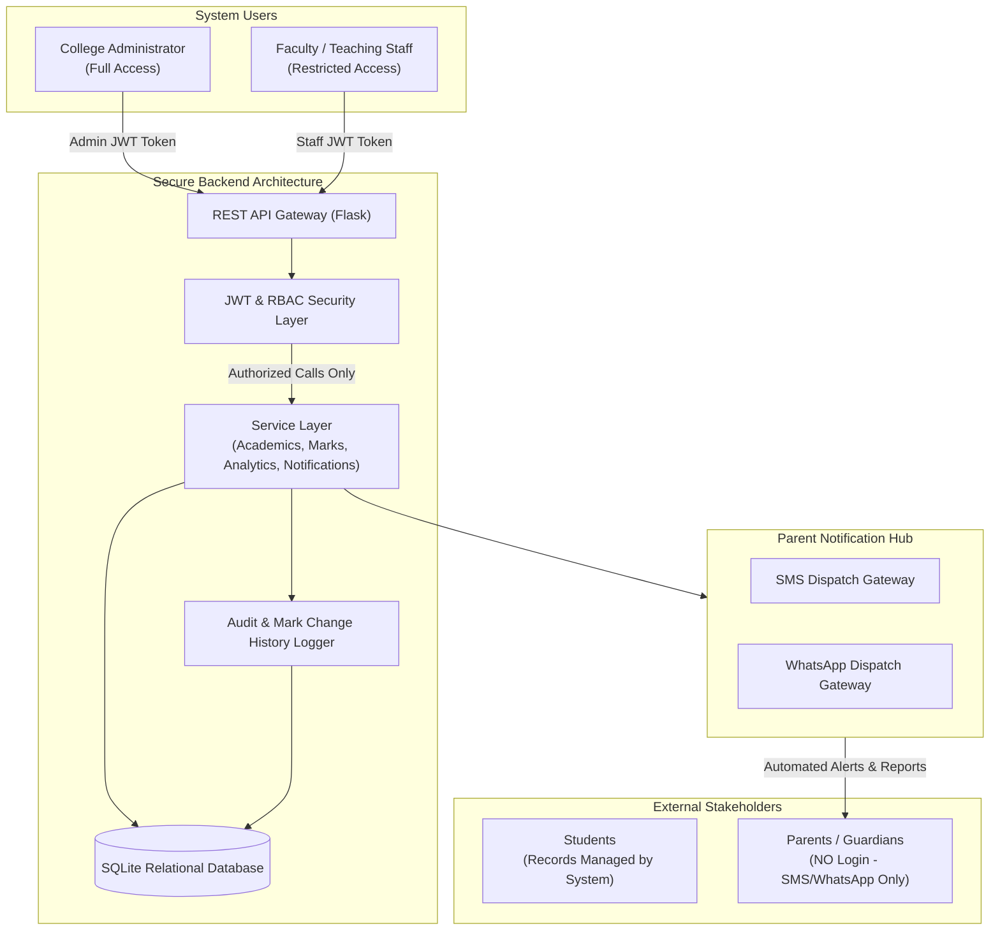

# Academic Performance and Parent Notification Platform: System Architecture

## 1. System Overview

The **Academic Performance and Parent Notification Platform** is a multi-tier web application designed for higher education institutions (engineering and arts & science colleges). It centralizes academic hierarchy management, internal assessment (IA-1 & IA-2) evaluation, multi-level analytics, and multi-channel parental alerts (SMS & WhatsApp).

### Key Actors & Access Boundaries

---

## 2. Layered Architecture

The application is architected into three distinct layers:

### 2.1 Client Layer (`/client`)
- **Technology**: Modern HTML5, ES6 Modules, and Vanilla CSS3 with a custom tokenized design system.
- **Aesthetics & UX**: High-contrast, clean typography (Inter / Outfit via Google Fonts), subtle glassmorphic surfaces, semantic color coding for performance tiers, responsive data tables, and dynamic modal interactions.
- **Role Awareness**: The frontend presents tailored UI flows for Admins (system controls, global analytics, notifications) and Staff (assigned classes and mark entry grid).
- **Security Precaution**: All client-side view restrictions are UX conveniences; server-side enforcement guarantees isolation.

### 2.2 Server Layer (`/server`)
- **Technology**: Python 3.13 + Flask application with modular Blueprint routing.
- **Authentication**: Stateless JSON Web Tokens (JWT) signed with HS256 algorithm.
- **Authorization (RBAC)**:
  - `@token_required`: Validates JWT authenticity and extracts user context.
  - `@admin_required`: Restricts endpoints strictly to users with the `admin` role.
  - `@staff_required`: Confirms staff credentials and verifies assigned section/subject ownership before granting mark mutation access.
- **Audit Logging**: Every mark alteration generates an immutable audit record logging `previous_marks`, `new_marks`, `changed_by`, `reason`, and `timestamp`.

### 2.3 Documentation & Data Layer (`/docs` & SQLite)
- **Persistence**: SQLite relational database with enforced foreign keys (`PRAGMA foreign_keys = ON`), indexed lookups, and transactional integrity.
- **Documentation**: Standardized markdown documentation for Architecture, Role Permissions, and Database Schemas.

---

## 3. Communication & Notification Strategy

Parents **do not** have login access. The system maintains verified contact details (`primary_phone`, `whatsapp_number`) and dispatches notifications for:
1. **IA-1 Marks Publication**: Individual student subject-wise marks and section average.
2. **IA-2 Marks Publication & Comparative Analysis**: Progression or regression from IA-1 to IA-2 with faculty remarks.
3. **Critical Performance Alerts**: Warning notifications when a student scores below defined passing or remediation thresholds.
4. **General College & Department Circulars**: Official notices broadcast to parents by department or year.

---

## 4. Scalability & Extensibility

- **Decoupled Blueprints**: The backend is organized into modular blueprints (`auth`, `admin`, `staff`, `marks`, `notifications`), enabling seamless migration to microservices or dedicated worker queues if scaled to tens of thousands of concurrent students.
- **Database Portability**: The schema uses standard SQL DDL, making migration to PostgreSQL or MySQL transparent if multi-node clustering is required in the future.
